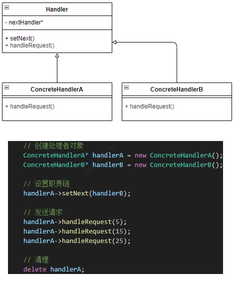

# design_pattern

## 创建型模

**工厂方法模式** ：灵活创对象，适用于需灵活创建对象处

**抽象工厂模式** ：创相关对象，用于创建系列相关对象场景。

**单例模式** ：确保单实例，适合全局共享资源场景。

**建造者模式** ：分步建复杂，用于逐步构建复杂对象情况。

**原型模式** ：复制生新体，大量创建相似对象时适用 。

## 结构型模式

**适配器模式** ：接口转换器，让不兼容接口协同工作。

**装饰模式** ：动态添功能，动态为对象增加职责。

**代理模式** ：控制对象访，用于控制对其他对象的访问。

**外观模式** ：简化子接口，为子系统提供统一简单接口。

**组合模式** ：树形部分整，表现 “部分 - 整体” 树形结构。

**桥接模式** ：分离抽象实，使抽象和实现可独立变化。

**享元模式** ：共享省内存，适用于大量相似对象共享场景。

## 行为型模式

**观察者模式** ：一对多依赖，对象状态变时通知依赖对象。

**状态模式** ：状态定行为，依内部状态改变对象行为。

**模板方法模式** ：骨架延子类，定义算法骨架，子类细化步骤。

**策略模式** ：算法可互换，不同情况选用不同算法。

**责任链模式** ：请求逐处理，多个对象处理请求，避免耦合。

**命令模式** ：请求封对象，实现请求的参数化、排队等操作。

**迭代器模式** ：顺序访元素，顺序访问聚合对象元素。

**中介者模式** ：中介控交互，封装对象交互，降低耦合。

**备忘录模式** ：存状态可复，保存和恢复对象内部状态。

**访问者模式** ：新操作独立，不改变元素类定义新操作。

**解释器模式** ：文法解释器，定义语言文法并解释句子 。

