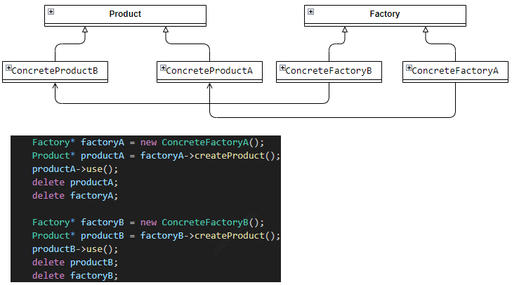
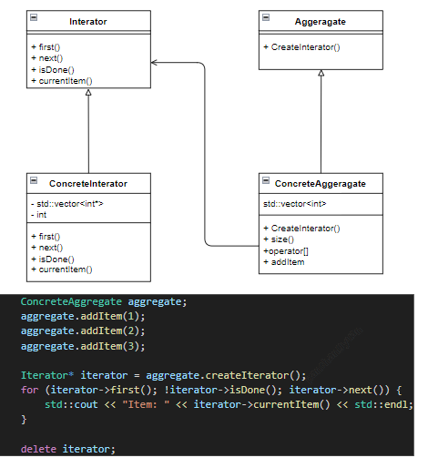

# design_pattern

## 创建型模

**工厂方法模式** ：定义一个创建对象的接口，让子类决定实例化哪个类，用于根据不同条件创建不同类型对象的场景，如根据用户输入创建不同图形。

**抽象工厂模式** ：创建一系列相关对象，而无需指定具体类，适用于需要创建一组相关对象，且对象之间有依赖关系的场景，如创建不同操作系统的用户界面组件。

**单例模式** ：确保一个类只有一个实例，并提供一个全局访问点，适用于需要全局唯一实例，如系统配置对象、日志记录器等场景。

**建造者模式** ：将复杂对象的构建与其表示分离，使同样的构建过程可以创建不同的表示，用于创建复杂对象，且创建过程步骤较多、顺序固定的场景，如创建游戏角色。

**原型模式** ：通过复制现有对象来创建新对象，适用于创建对象成本较高，且可以通过复制现有对象来获取新对象的场景，如复制游戏场景中的角色。

## 结构型模式

**适配器模式** ：将一个类的接口转换成客户希望的另一个接口，使不兼容的接口能一起工作，用于将现有类与不兼容的接口进行适配，如将旧的支付接口适配到新的系统中。

**装饰模式** ：动态地给一个对象添加一些额外的职责，适用于在不改变原有对象结构的情况下，为对象添加功能的场景，如给文本添加不同的格式效果。

**代理模式** ：为其他对象提供一种代理以控制对这个对象的访问，适用于当需要在访问对象时进行一些额外处理，如权限控制、缓存等场景。

**外观模式** ：为子系统中的一组接口提供一个一致的界面，适用于简化复杂子系统的访问，为客户端提供一个统一的入口点的场景，如电脑的开机操作，隐藏了内部复杂的硬件启动过程。

**组合模式** ：将对象组合成树形结构以表示 “部分 - 整体” 的层次结构，适用于处理具有层次结构的对象，如文件系统中的文件和文件夹。

**桥接模式** ：将抽象部分与实现部分分离，使它们可以独立变化，适用于当抽象和实现之间存在多种组合关系，且需要独立扩展时的场景，如不同颜色和形状的图形组合。

**享元模式** ：运用共享技术有效地支持大量细粒度的对象，适用于需要创建大量相似对象，且对象有可共享状态的场景，如游戏中的大量树木、草地等对象。

## 行为型模式

**观察者模式** ：定义对象间的一种一对多的依赖关系，当一个对象的状态发生改变时，所有依赖于它的对象都会得到通知并被自动更新，适用于实现事件监听机制，如新闻发布系统。

**状态模式** ：允许一个对象在其内部状态改变时改变它的行为，对象看起来似乎修改了它的类，适用于对象的行为取决于其内部状态，且状态可能会发生变化的场景，如游戏角色的不同状态（奔跑、跳跃、攻击等）。

**模板方法模式** ：定义一个操作中的算法骨架，而将一些步骤延迟到子类中，适用于有固定算法步骤，但某些步骤的实现可以由子类决定的场景，如游戏中的角色创建流程。

**策略模式** ：定义一系列算法，将每个算法封装起来，并使它们可以互换，适用于在不同情况下使用不同算法，且算法可以动态切换的场景，如不同的排序算法。

**责任链模式** ：将请求沿着处理者链进行传递，直到有处理者处理该请求，适用于处理请求的对象不明确，需要根据一定规则动态选择处理者的场景，如员工请假审批流程。

**命令模式** ：将一个请求封装为一个对象，从而使你可以用不同的请求对客户进行参数化，适用于将请求发送者和接收者解耦，如游戏中的操作记录与回放。

**迭代器模式** ：提供一种方法顺序访问一个聚合对象中的各个元素，而又不暴露该对象的内部表示，适用于遍历集合对象，如遍历数组、链表等。

**中介者模式** ：用一个中介对象来封装一系列的对象交互，适用于对象之间存在复杂的交互关系，通过中介者可以简化交互逻辑的场景，如聊天室中的消息传递。

**备忘录模式** ：在不破坏封装性的前提下，捕获一个对象的内部状态，并在该对象之外保存这个状态，适用于需要保存和恢复对象状态的场景，如游戏中的存档与读档。

**访问者模式** ：表示一个作用于某对象结构中的各元素的操作，它使你可以在不改变各元素的类的前提下定义作用于这些元素的新操作，适用于对对象结构中的元素进行不同的操作，且操作不依赖于元素的具体类型的场景，如对不同类型的文件进行不同的处理。

**解释器模式** ：给定一个语言，定义它的文法的一种表示，并定义一个解释器，这个解释器使用该表示来解释语言中的句子，适用于需要解释和执行特定语言的场景，如简单的数学表达式解释器。

